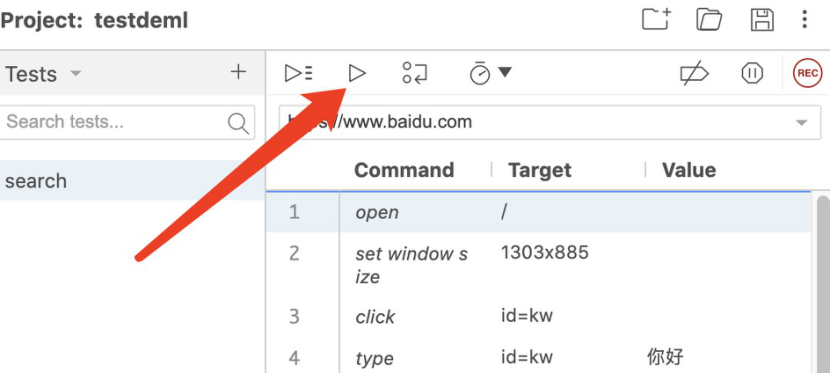
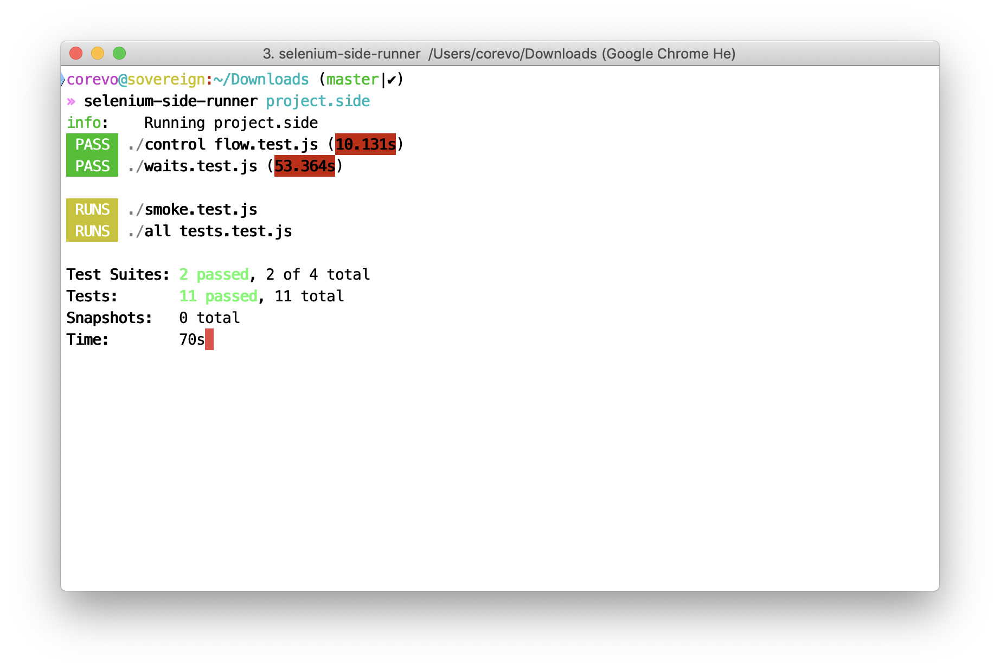
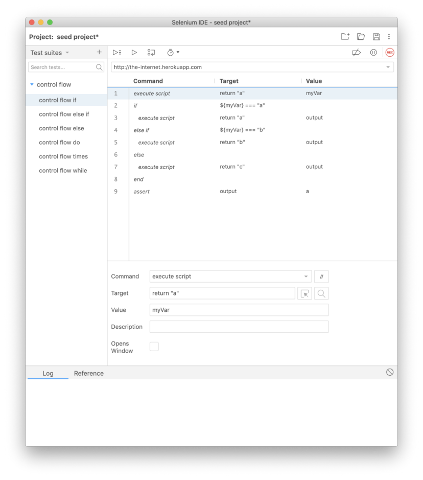
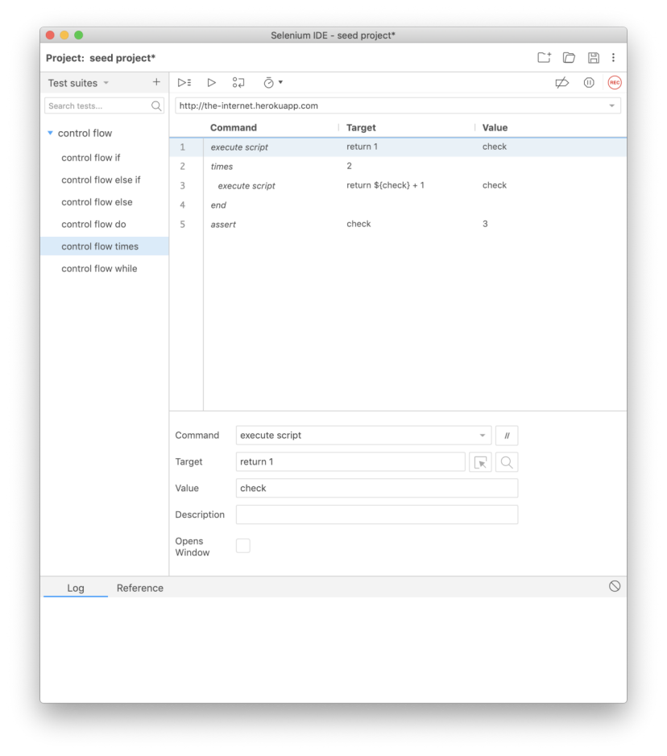
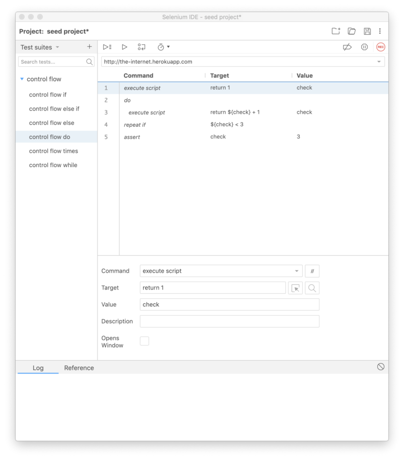
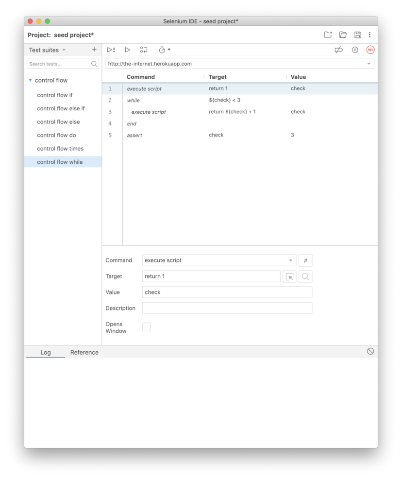
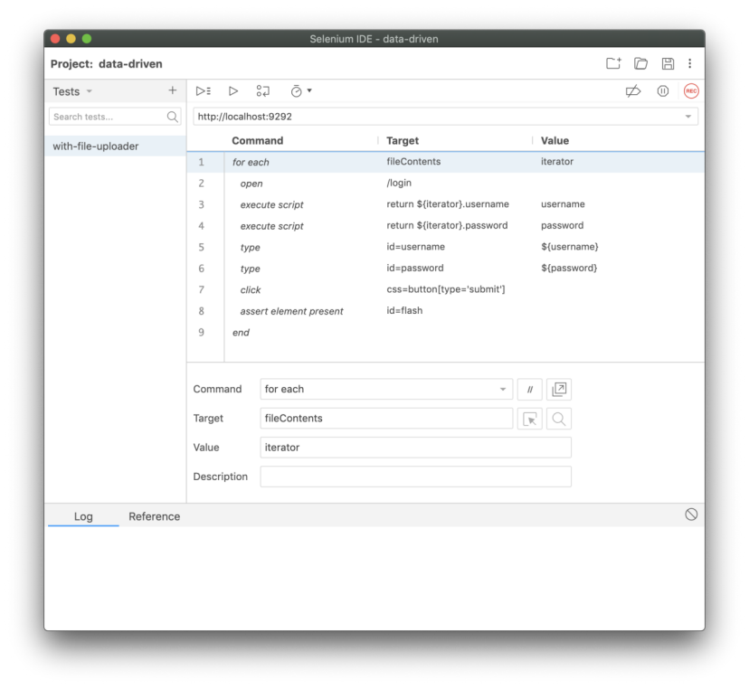
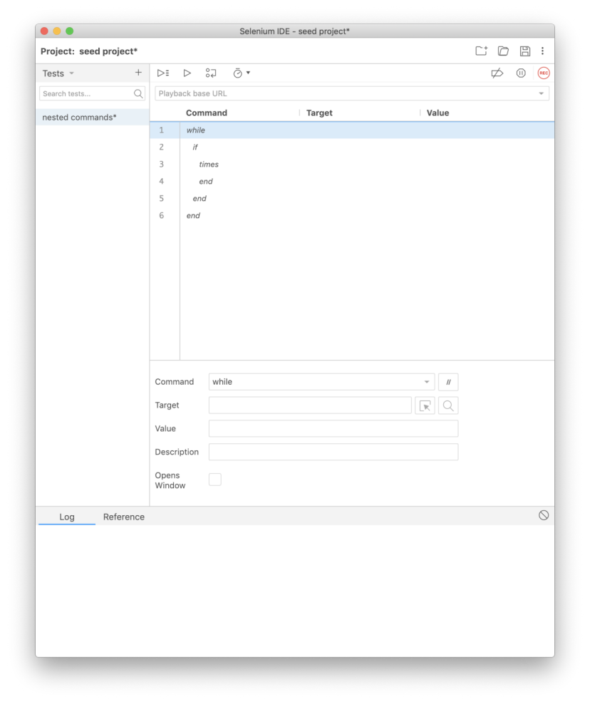
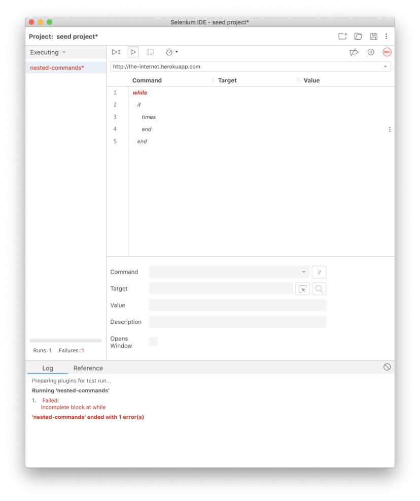
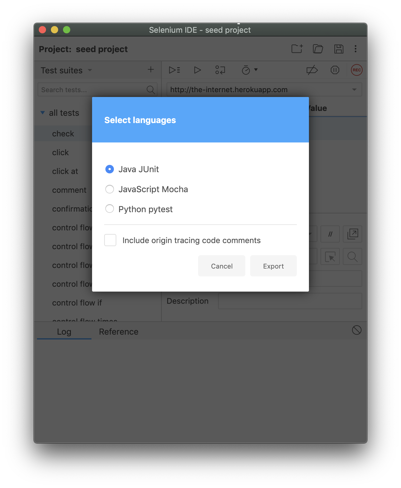

一、API
=======

一、入门
--------

1.1 安装
~~~~~~~~

​ 从Chrome或Firefox网络商店安装Selenium IDE。

1.2 启动Selenium IDE
~~~~~~~~~~~~~~~~~~~~

​ 安装后，通过浏览器菜单栏单击其图标来启动它。

1.3 故障排除
~~~~~~~~~~~~

​ 如果您没有在菜单栏看到Selenium IDE图标，请参照以下解决方案。

-  选项1

   ​ 确保在浏览器的扩展程序设置中启用了
   IDE。您可以通过在地址栏中键入以下内容并点 击 Enter。

   -  Chrome:chrome://extensions
   -  Firefox: about:addons

-  选项2

   ​
   该扩展名可能已启用，但图标已隐藏。尝试调整菜单栏的大小，以提供更多空间。

​ 在 Chrome
浏览器中，您可以通过以下方法进行操作:单击地址栏的右侧，按住该单
击，然后将其向左或向右拖动。

​ 在 Firefox 中，您需要右键单击，单击
Customize，对菜单栏进行调整，然后单击 Done。

1.4 欢迎屏幕
~~~~~~~~~~~~

​ 启动 Selenium IDE 后，将显示一个欢迎对话框。 这将使您快速访问以下选项:

-  在新项目中记录测试
-  打开一个现有项目
-  创建一个新项目
-  关闭Selenium IDE

​ 如果这是您第一次使用Selenium
IDE（或者您正在启动新项目），请选择第一个选项。

1.5 记录您的第一个测试
~~~~~~~~~~~~~~~~~~~~~~

​ 创建新项目后，将提示您命名它，然后要求您提供基本 URL。基本 URL
是您正在测试 的应用程序的
URL。只需设置一次，他就会在该项目的所有测试中使用它。如果需要，您可以稍后更改。

​ 完成这些设置后，将打开一个新的浏览器窗口，加载基本 URL，并开始记录。

​ 与页面进行交互，您的每个动作都将记录在 Selenium IDE
中。要停止录制，请切换到 Selenium IDE 窗口，然后单击录制图标。

1.6 组织您的测试
~~~~~~~~~~~~~~~~

1.6.1测试用例
^^^^^^^^^^^^^

​ 您可以通过单击左侧边栏菜单顶部的+号(在 Tests
标题的右侧)，将新创建的测试用例命 名，最后通过单击 Add 按钮完成添加。

​ 添加后，您可以手动输入命令，也可以单击 Selenium IDE 右上角的记录图标。

1.6.2 测试用例集
^^^^^^^^^^^^^^^^

​ 测试用例可以一起分组到测试用例集中。在创建项目时，Default Suite
会创建一个，并且您的第一个测试用例会自动添加到其中。

1.6.3 添加测试用例
^^^^^^^^^^^^^^^^^^

​
要将测试用例填加到测试用例集之中，请将鼠标悬停在测试用例的名称上，然后执行以
下操作:

​ 步骤一:单击 Tset Suites 标题右侧显示的图标。

​ 步骤二请点击 Add tests。

​ 步骤三:从菜单中选择要添加的测试用例。

​ 步骤四:请点击 Select。

1.6.4 删除测试用例
^^^^^^^^^^^^^^^^^^

​
要删除某条测试用例，请将鼠标悬停在该测试用例上，然后单击出现在其名称右侧的
❌。

1.6.5 删除或重命名测试用例
^^^^^^^^^^^^^^^^^^^^^^^^^^

​
要删除测试用例，请单击其名称右侧出现的图标，单击Delete，然后在出现Delete提示时再次单击。

​
要重命名测试用例，请单击要重命名的测试用例右侧的图标，在下拉菜单中选择Rename，并在弹出的对话框中输入新的命名，最后单击Rename。

1.6.6保存工作
^^^^^^^^^^^^^

​ 要保存您刚刚在 Selenium IDE 中完成的所有操作，请单击 Selenium IDE
右上角的保存图标。

1.7 回放
~~~~~~~~

1.7.1 浏览器内
^^^^^^^^^^^^^^

​ 您可以在Selenium
IDE中回放测试用例，方法是选择要回放的测试用例或测试用例集，然后单击测试编辑器上方菜单栏中的回放按钮(见下图)。

  
​
测试用例将在浏览器中回放，如果仍在从录制中打开一个窗口，则将其用于回放。否则，
将打开并使用一个新窗口。

1.7.2 跨浏览器
^^^^^^^^^^^^^^

​ 如果您想在其他浏览器上运行 Selenium IDE 测试，请务必查看命令行运行器。

二、命令行运行器
----------------

​ 现在，您可以在任何浏览器上并行运行所有 Selenium IDE 测试，也可以在
Grid 上运行， 而无需编写任何代码。

​ 只需安装 Selenium IDE
命令行运行程序，获取必要的浏览器驱动程序(如果在本地运
行测试)以及从命令提示符启动具有所需选项的运行程序，就可以了。

  

2.1 先决条件
~~~~~~~~~~~~

​ 要使命令行程序正常运行，需要以下依赖项：

-  node （Node.js编程语言）版本8或10。
-  npm (Node.js 程序包管理器)，通常与 node 一起安装。
-  Selenium-side-runner (Selenium IDE 命令行程序)。
-  以及我们要使用的浏览器驱动程序(在下一节中有更多介绍)

::

   > brew install node
   > npm install -g selenium-side-runner

​
注意，您的系统配置可能与上面的示例中所使用的配置不同（例如，MacOS上的Homebrew）。如果是这样，请参阅\ `软件包管理的Node安装文档 <https://nodejs.org/en/download/package-manager/>`__\ ，或直接从\ `Node
downloads <https://nodejs.org/en/download/>`__\ 页面下载适用于您操作系统的Node安装程序。

2.2 安装浏览器驱动程序
~~~~~~~~~~~~~~~~~~~~~~

​ 如果要在本地运行测试用例，则每个浏览器都需要一些其他设置。

​ Selenium
通过一个成为浏览器驱动程序的小型二进制应用程序与每个浏览器进行通
信。每个浏览器都有自己的驱动程序，您可以手动下载这些浏览器驱动程序并将其添加到系统路径中，也可以使用软件包管理器安装最新版本的浏览器驱动程序(推荐)。

​ 您还需要在计算机上安装浏览器。

2.2.1 Chrome
^^^^^^^^^^^^

​ 要使用 Chrome，您首先需要安装 ChromeDriver。

::

   > npm install -g chromedriver

2.2.2 Edge
^^^^^^^^^^

​ 要使用 Microsoft Edge，您需要在 Windows 上运行，并且还需要安装
EdgeDriver。

::

   > npm install  -g edgedriver

2.2.3 Firefox
^^^^^^^^^^^^^

​ 要使用 Firefox，您首先需要安装 geckodriver。

::

   > npm install -g geckodriver 

2.2.4 IE
^^^^^^^^

​ 要使用 IE 浏览器，您需要在 Windows 上运行，并且还需要安装 IEDriver。

::

   > npm install -g iedriver

​
要使用IEdriver工作，还需要一些其他的设置。详细信息\ `在这里 <https://github.com/SeleniumHQ/selenium/wiki/InternetExplorerDriver>`__\ 。

2.2.5 Safari
^^^^^^^^^^^^

​ 要使用safari，您首先需要安装SafariDriver。

​ 它附带了最新版本的
Safari。您只需采取几个步骤就可以在计算机上启用它。有关详细 信息，请参见
`SafariDriver
文档的本部分 <https://developer.apple.com/documentation/webkit/testing_with_webdriver_in_safari>`__\ 。

2.2.6 启动运行器
^^^^^^^^^^^^^^^^

​ 安装 selenium-side-runner
完所有组件后，只需要在命令行中调用测试，然后在调用之
前保存的项目文件的路径即可运行测试。

::

   seleniumside-runner /path/to/your-project.side

​ 注意，如果您有多个.side 文件，则可以使用通配符(例如/path/to/*.side)

​ 当您运行此命令时，它将在多个浏览器窗口中并行启动测试，并跨 n 进程分布(
n是计算机上可用 CPU 内核的数量)。

​ 在运行时，可以通过提供的各种参数配置进程数量(以及其他事项)。

​
注意:并行执行在测试用例集级别上自动发生。如果需要并行执行测试用例集中的测试用例，则需要更改一个设置。有关详细信息，请参见测试用例集中的测试并行化。

2.3 运行时配置
~~~~~~~~~~~~~~

​ 使用运行程序，您可以在运行时传递不同的配置参数。

2.3.1 在本地不同的浏览器上运行
^^^^^^^^^^^^^^^^^^^^^^^^^^^^^^

​ 最常见的功能用法是为本地测试执行指定不同的浏览器。

​ 如果需要指定的浏览器为 Chrome 浏览器，您可以在 Selenium IDE
的命令行程序中键 入以下命令:

::

   selenium-side-runner -c "browserName=chrome"

​ 如果需要指定的浏览器为 IE 浏览器，您可以在 Selenium IDE
的命令行程序中键入以下 命令:

::

   selenium-side-runner -c "browserName='internet explorer'"

​ 如果需要指定的浏览器为 Edge 浏览器，您可以在 Selenium IDE
的命令行程序中键入以下命令:

::

   selenium-side-runner -c "browserName=edge"

​ 如果需要指定的浏览器为火狐浏览器，您可以在 Selenium IDE
的命令行程序中键入以 下命令:

::

   selenium-side-runner -c "browserName=firefox"

​ 如果需要指定的浏览器为 safari 浏览器，您可以在 Selenium IDE
的命令行程序中键入 以下命令:

::

   selenium-side-runner -c "browserName=safari"

​
注意:在本地运行测试用例时，每个浏览器都需要进行一些设置。有关详细信息，请参见2.2节安装浏览器驱动程序。

2.3.2 在Selenium Grid上运行
^^^^^^^^^^^^^^^^^^^^^^^^^^^

​ 要在 Grid(例如，您自己的 Grid 或诸如 Sauce Labs
的托管程序)上运行测试，可以 指定它以及其他功能。

::

   Selenium-side-runner --version http://locahost:4444/wd/hub -c“browserName='internet explorer' version='11.0' platform='Windows 8.1”

​ –version 指定 Grid 的 URL，并且-c 是您希望 Grid 使用的功能。

​
您可以\ `在此处 <https://github.com/SeleniumHQ/selenium/wiki/DesiredCapabilities>`__\ 查看可用功能的完整列表。

2.3.3 指定并行进程数
^^^^^^^^^^^^^^^^^^^^

​ 在 Grid
上运行时，您可能需要控制正在运行的并行会话数。为此，您可以使用-w n 命
令标志(其中 n 是所需的进程数)。

::

   Selenium-side-runner -w 10 --server http://locahost:4444/wd/hub

​ 运行程序将自动将工作程序数量设置为计算机上可用的 CPU
核心数量。在大多数情况 下，这是最佳的选择。

2.3.4 Chrome特定功能
^^^^^^^^^^^^^^^^^^^^

​ 如果您将 Chrome 安装在计算机的非标准位置，则可以指定路径，以便
ChromeDriver 知道要查找的位置。

​ 您可以在 Selenium IDE 命令行程序中键入以下命令来指定路径:

::

   selenium-side-runner -c "goog:chromeOptions.binary='/path/to/non-standard/Chrome/insta
   ll'"

​ 使用特定于 Chrome 的功能，您还可以运行无头测试。

::

   selenium-side-runner -c "goog:chromeOptions.args=[disable-infobars, headless]"

2.4 触手可及的框架
~~~~~~~~~~~~~~~~~~

​
除此之外，还有一些其他的细节。这些正是您期望在传统的测试自动化框架中可以得到
的东西。

2.4.1 更改 base URL
^^^^^^^^^^^^^^^^^^^

​ 通过指定不同的 base
URL，您可以轻松地将测试指向不同的环境(例如，本地开发、测
试、试运行、生产)。

::

   selenium-side-runner --base-url https://localhost

2.4.2 筛选测试用例
^^^^^^^^^^^^^^^^^^

​ 您还可以选择使用–filter target 命令标志(其中 target
是正则表达式值)运行测试的目
标子集。包含给定搜索条件的测试名称将是唯一运行的测试名称。

::

   Selenium-side-runner --filter smoke

2.4.3 将测试结果输出到文件
^^^^^^^^^^^^^^^^^^^^^^^^^^

​ 如果需要将测试结果导出到文件中(例如，作为 CI
进程的一部分运行时)，则可以使用–output-directory 和–output-format
标志的组合。

​ –output-directory
定义放置测试结果文件的位置。它可以采用绝对路径或相对路径。

​ –output-format 定义用于测试结果文件的格式。它可以是 jest(例如，JSON)或
junit (例如，XML)。默认格式为 jest(例如，如果您未指定类型)。

::

   Selenium-side-runner --output-directory=results
   # Outputs result in ‘jest’ frormat in ‘./results/projectName.json’
   selenium-side-runner--output-directory=results--output-format= jest
   # Outputs results in `jest` frormat in`./results/projectName.json'
   selenium-side-runner--output-directory=results--output-format= junit
   # Outputs results in `junit` frormat in`./results/projectName.xml'

2.4.4 指定默认配置
^^^^^^^^^^^^^^^^^^

​
您可以将运行时参数存储在配置文件中，而不是记住您需要的所有命令行参数(这可能
会变得很笨拙)。

​ 您可以使用两种配置文件。

-  选项1

   在将要运行测试的目录中创建一个.side.yml 文件。运行器将自动运行它。
   这是文件内容的示例。

   ::

      capabilities:
      browserName:”firefox”
      baseUrl:”https://www/seleniumhq.org” Server:”http://localhost:4444/wd/hub”

   如果要忽略文件并改变命令行参数，在运行时与其他命令一起使用–no-sideyml。

-  选项2

   除了使用.side.yml 文件之外，您还可以在 YAML
   文件中使用您选择的名称和位置指定运行时参数，然后在运行测试时指定其位置。

   ::

      Selenium-side-runner --config-file “/path/to/your/config.yaml”

   注意:使用–config-file 标志时，.side.yml 将被忽略。

2.5 Selenium IDE 配置
~~~~~~~~~~~~~~~~~~~~~

2.5.1 在 Test Suite 中进行并行化测试
^^^^^^^^^^^^^^^^^^^^^^^^^^^^^^^^^^^^

​
运行器以开箱即用的方式并行执行测试用例，但测试用例集中的测试按顺序执行。

​ 要在给定测试用例集中并行运行测试用例，您需要在 Selenium IDE
中更新该测试用例 的设置。

   ​ 步骤一:切换到 Test Suites Selenium IDE 中的视图;

   ​ 步骤二:点击您要配置的套件名称旁边的下拉菜单，然后点击 Settings;

   ​ 步骤三:单击复选框 Run in parallel;

   ​ 步骤四:点击 submit;

   ​ 步骤五:保存您的 Selenium IDE 项目文件。

​ 要配置多个测试用例集以这种方式运行，请在每个测试用例集中重复步骤
1-4.完成后， 请确保保存项目文件。

2.6 高级选项
~~~~~~~~~~~~

2.6.1 其他参数
^^^^^^^^^^^^^^

​ Selenium IDE 的插件可以指定自己的唯一运行时参数。您可以通过–params
标志使用 它们。

​ 此选项采用各种选项的字符串(类似于您指定功能的方式)。

2.6.2 基本用法
^^^^^^^^^^^^^^

​ 您指定参数的名称及其值。最基本的方法是指定一个字符串值。

::

   selenium-side-runner --params “a=’example-value’”

2.6.3 嵌套参数
^^^^^^^^^^^^^^

​ 参数也可以使用点符号进行嵌套。

::

   selenium-side-runner --params “a.b=’another example-value’”

2.6.4 数组值
^^^^^^^^^^^^

​ 除了字符串，还可以指定字母数字值的数组。

::

   Selenium-side-runner --params “a.b.c=[1,2,3]”

2.6.5 多个参数
^^^^^^^^^^^^^^

​ –params 只能被调用一次，但是可以通过空格分隔来指定多个参数。

::

   Selenium-side-runner --params “a=’example-value’ a.b=’another example-value’a.b.c=[1,2,3]”

2.7 使用代理服务器
~~~~~~~~~~~~~~~~~~

2.7.1 直接代理
^^^^^^^^^^^^^^

​ 此选项将 WebDriver 配置为绕过所有浏览器代理。

​ 在命令中:

::

   selenium-side-runner --proxy-type=direct

​ 在.side.yaml :

::

   proxyType:direct

2.7.2 手动代理
^^^^^^^^^^^^^^

​ 手动配置浏览器代理。

​ 在命令行中:

::

   Selenium-side-runner
   --proxy-options=”http=localhost:434 bypass=[http://localhost:434, http://localhost:8080]”

​ 在.side.yaml:

::

   proxyType:manual proxyOptions: http:http://localhost:434 https:http://localhost:434 ftp:http://localhost:434 bypass:
   - http://localhost:8080
   - http://host:434
   - http://somethingelse:32

2.7.3 PAC 代理
^^^^^^^^^^^^^^

​ 配置 WebDriver 以使用给定 URl 处的 PAC 文件设置浏览器代理。

​ 在命令行中:

::

   Selenium-side-runner--proxy-type=pac--proxy-options=”http://lo
   calhost/pac”

​ 在.side.yaml:

::

   proxyType : pac
   proxyOptions : http://localhost/pac

2.7.4 SOCKS 代理
^^^^^^^^^^^^^^^^

​ 为 SOCKS 代理创建代理配置。

​ 在命令行中:

::

   Selenium-side-runner--proxy-type=socks--proxy-options=
   ”socksProxy=localhost:434 socksVersion=5”

​ 在.side.yaml :

::

   proxyType: socks 
   proxyOptions: 
   sockProxy: localhost:434
   socksVersion

2.7.5 系统代理
^^^^^^^^^^^^^^

​ 配置 WebDriver 以使用当前系统的代理。

​ 在命令行中:

::

   Selenium-side-runner --proxy-type=system

​ 在.side.yaml :

::

   proxyType :system

2.8 代码导出
~~~~~~~~~~~~

​ 如果您想学习如何将记录的测试用例转换为 WebDriver
代码，或者想要将记录的测试
用例集成到现有的自定义测试框架中，则需要的是代码导出，现在可用于某些语言。您可以\ `在此处 <https://www.selenium.dev/selenium-ide/docs/en/introduction/code-export>`__\ 了解更多\ `信息 <https://www.selenium.dev/selenium-ide/docs/en/introduction/code-export>`__!

三、控制流
----------

3.1 Javascript 表达式
~~~~~~~~~~~~~~~~~~~~~

​ 通过使用 JavaScript 表达式检查应用程序中的条件。

​ 您可以在测试过程中的任何时候使用 execute script 或 execute async
script 命令运行 一段 JavaScript
程序，并将结果存储在变量中。这些变量可以在控制流命令中使用。

​ 您也可以直接在控制流命令中使用 JavaScript 表达式。

3.2 可用命令
~~~~~~~~~~~~

​ 控制流命令通过指定打开和关闭命令来表示一组命令(或块)来工作。

​ 以下是每个可用的控制流命令以及它们的伴随命令和/或关闭命令。

-  if,else if,else,end
-  times,end
-  do,repeat if
-  while,end

让我们逐一介绍示例。

3.3 条件分支
~~~~~~~~~~~~

​ 条件分支使您可以更改测试中的行为。

  

   

3.3.1 if
^^^^^^^^

​ 这是条件块的打开命令。

​ 同时提供了您要评估的 JavaScript 表达式。这可以包含从测试中的先前
JavaScript 表 达式创建的变量。所有这些都 target 输入到 if
命令的输入字段中。

​ 如果该表达式评估为 true
则测试用例将执行它后面，直到下一个条件控制流命令命令 (例如，else
if，else，或 end)。

​ 如果表达式的计算来 false
将跳过随后的命令和跳转到下一个相关条件控制流命令(例 如，else
if，else，或 end)。

3.3.2 else if
^^^^^^^^^^^^^

​ 该命令在 if 命令块中使用。

​ 就像 if 在 target 输入字段中使用 JavaScript
表达式来求值一样，执行它后面的命令分
支，或者跳到下一个相关的控制流命令(例如 else 或 end)。

3.3.3 else
^^^^^^^^^^

​ else 是您在一个 if
区块中可以拥有的最终条件。如果不满足任何先决条件，则将执行 此命令分支。

​ 完成后，将跳转到 end 命令。

3.3.4 end
^^^^^^^^^

​
该命令终止条件命令块。没有它，命令块将不完整，您将收到一条有用的错误消息，让
您知道何时尝试运行测试。

3.4 循环回放
~~~~~~~~~~~~

​ 循环使您可以遍历给定的命令集。

3.4.1 times
^^^^^^^^^^^

​ 有了 times 你可以指定一个迭代次数要执行的命令集。该数字进入命令的
target 输入字 段 times。

​ 要关闭 times 命令块，请确保使用 end 命令。

   

3.4.2 do
^^^^^^^^

​ 您从 do 命令开始此循环，然后是要执行的命令，然后以 repeat if
命令结束。repeat if 接受您要在 target 输入字段中求值的 JavaScript
表达式。

​ do 将先执行之后的命令，然后再 repeat if
对中的表达式求值。如果表达式返回 true 则 测试将跳回到 do
命令并重复该序列。

  

  

​ 这将一直持续到条件返回 false 或触发无限循环保护-默认为 1000
尝试。您可以通过 value 在 repeat if
命令的输入字段中指定一个数字来覆盖此默认值。

3.4.3 while
^^^^^^^^^^^

​ 通过 while 提供 JavaScript 表达式，您希望在 target
输入字段中求值。如果它求值到 true 命令块，则将继续执行直到到达 end
命令。

​ 完成后，测试将跳回到 while 命令并重复相同的顺序(首先检查条件是否变为
true 或 false)。

​ 要关闭 while 命令块，请使用 end 命令。

   

​ 循环将重试，直到条件返回 false 或无限循环保护被触发为止(默认为 1000
尝试)。 您可以通过 value 在 while
命令的输入字段中指定一个数字来覆盖此默认值。

3.4.4 forEach
^^^^^^^^^^^^^

​ 尽力做到最好，我们有能力遍历一个集合(例如，一个 JS
数组)，并在我们执行该过 程时引用该集合中的每个项目。

​ 在该 target 字段中，指定包含要迭代的数组的变量的名称。在该 value
字段中，指定要
使用的迭代器变量的名称。对于数组中的每个条目，将执行以下命令。在每次迭代期间，将
通过迭代器变量访问当前条目的内容。

 

3.5 嵌套命令
~~~~~~~~~~~~

​ 您可以根据需要嵌套控制流命令(例如，一个 if 块可以放在一个 while
块内部，反之亦然)。

  

3.6 语法验证
~~~~~~~~~~~~

​ 如果不确定控制流语法是否正确，请尝试运行测试以查看。Selenium IDE
将发现控制 流语法中的错误，并调出不正确或丢失的特定命令。

   
  

四、代码导出
------------

4.1 入门
~~~~~~~~

​ 您可以通过右键单击测试用例或测试用例集，选择
Export，选择目标语言，然后单击，将测试(test) 用例或测试用例集(test
suite)导出为 WebDriver 代码。

 

​ 这会将包含导出的目标语言代码的文件保存到浏览器的下载目录中。

4.2 源代码跟踪注释
~~~~~~~~~~~~~~~~~~

​ 导出时，有一个可选的切换开关用来启用源代码跟踪注释。

​ 这将在导出的文件中放置内联代码注释，其中包含生成它的 Selenium IDE
中的测试步 骤的详细信息。

4.3 支持的导出
~~~~~~~~~~~~~~

​ 当前，支持导出到以下语言和测试框架。

-  C#NUnit
-  Java JUnit
-  Javascript Mocha
-  Python pytest

​ 我们打算在每种语言的至少一个测试框架中支持所有官方支持的 Selenium
编程语言绑 定(例如 Java，JavaScript，C#，Python 和 Ruby)。

​
欢迎提供帮助以添加特定语言的新语言和测试框架。有关\ `如何操作 <https://www.selenium.dev/selenium-ide/docs/en/introduction/code-export>`__\ 的详细信息，请参见\ `如何贡献 <https://www.selenium.dev/selenium-ide/docs/en/introduction/code-export>`__\ 。

4.3.1 C#NUnit
^^^^^^^^^^^^^

​ C#NUnit 的导出代码被构建为与.NET Core，NUnit 3.11 和最新版本的
Selenium 一起 使用。

​ 要创建一个与 NUnit 一起使用的新样板项目，请使用以下 dotnet new 命令。

::

   dotnet new nunit -n NUnit-Tests --framework netcoreapp2.0

​ 使用以下.csproj 文件，您可以使用以下 dotnet restore
命令安装正确的软件包和版本。

::

   <!-- filename: example.csproj -->
   <Project Sdk="Microsoft.NET.Sdk">

     <PropertyGroup>
       <TargetFramework>netcoreapp2.0</TargetFramework>

       <IsPackable>false</IsPackable>
     </PropertyGroup>

     <ItemGroup>
       <PackageReference Include="nunit" Version="3.11.0" />
       <PackageReference Include="NUnit3TestAdapter" Version="3.13.0" />
       <PackageReference Include="Microsoft.NET.Test.Sdk" Version="16.0.1" />
       <PackageReference Include="Selenium.Support" Version="4.0.0-alpha03" />
       <PackageReference Include="Selenium.WebDriver" Version="4.0.0-alpha03" />
     </ItemGroup>

   </Project>

::

    > dotnet restore example.csproj

4.3.2 C#xUnit
^^^^^^^^^^^^^

​ C#xUnit 的导出代码被构建为可与 C#，xUnit 和最新版本的 Selenium
一起使用。

​ 就像 C#Nunit 一样，您可以使用 dotnet
工具安装它，并在安装这些依赖项之后运行它 (例如，使用 Install-Package
Selenium.WebDriveror 或 dotnet add package Selenium.WebDriver)。

​ 要创建一个与 xUnit 一起使用的新样板项目，请使用以下 dotnet new 命令。

::

   > dotnet new xUnittests

​ 使用以下.csproj 文件，您可以使用以下 dotnet restore
命令安装正确的软件包和版本。

::

   <!-- filename: example.csproj -->
   <Project Sdk="Microsoft.NET.Sdk">

     <PropertyGroup>
       <TargetFramework>netcoreapp2.0</TargetFramework>

       <IsPackable>false</IsPackable>
     </PropertyGroup>

     <ItemGroup>
       <PackageReference Include="xunit" Version="2.4.1" />
       <PackageReference Include="Microsoft.NET.Test.Sdk" Version="16.0.1" />
       <PackageReference Include="Selenium.Support" Version="4.0.0-alpha03" />
       <PackageReference Include="Selenium.WebDriver" Version="4.0.0-alpha03" />
     </ItemGroup>

   </Project>

::

   > dotnet restore example.csproj

4.3.3 Java JUnit
^^^^^^^^^^^^^^^^

​ Java JUnit 的导出代码可与 Java 8，JUnit 4.12 和最新版本的 Selenium
一起使用。

​ 您应该能够将导出的 Java 文件放入带有 pom.xml
列出这些依赖关系的文件的标准Maven 目录结构中并运行它。

​ 这是一个示例 pom.xml，可帮助您入门。

::

   <project>
     <modelVersion>4.0.0</modelVersion>
     <groupId>org.seleniumhq.selenium</groupId>
     <artifactId>selenium-ide-java-code-export</artifactId>
     <version>1</version>
     <url>http://maven.apache.org</url>
     <dependencies>
       <dependency>
         <groupId>junit</groupId>
         <artifactId>junit</artifactId>
         <version>4.12</version>
         <scope>test</scope>
       </dependency>
       <dependency>
         <groupId>org.seleniumhq.selenium</groupId>
         <artifactId>selenium-java</artifactId>
         <version>4.0.0-alpha-3</version>
       </dependency>
     </dependencies>
   </project>

4.3.4 Javascript Mocha
^^^^^^^^^^^^^^^^^^^^^^

​ JavaScript Mocha 的导出代码被构建为与 Node 10，Mocha 6.1.x
和最新版本的Selenium 一起使用。

​ 安装这些依赖项(例如，使用 npm install)后，您应该能够获取导出的
JavaScript 文件并运行它。

​ 这是一个示例 package.json，可帮助您入门。

::

   {
   "dependencies": {
   "mocha": "^6.1.4", "selenium-webdriver": "^4.0.0-alpha.3" }
   }

4.3.5 Python pytest
^^^^^^^^^^^^^^^^^^^

​ Python pytest 的导出代码可与 Python 3，pytest 4.6.x 和最新版本的
Selenium 一起使用。

​ 安装这些依赖项(例如，使用 pip3 install)后，您应该能够获取导出的
JavaScript 文 件并运行它。

​ 这是一个示例 requirements.txt，可帮助您入门。

::

   Pytest == 4.6.3
   Selenium == 4.0.0a1
   > pip3 install -r ./requirements.txt

4.3.6 Ruby RSpec
^^^^^^^^^^^^^^^^

​ Ruby Rspec 的导出代码可与 Ruby 2.6.x，RSpec 3.9.x 和最新版本的
Selenium 一起 使用。

​ 通过使用 Bundler 和以下工具，Gemfile 您可以安装必要的依赖项。

::

   # Gemfile
   Source 'https://rubygems.org' 
   gem'selenium-webdriver'
   gem'rspec'

::

   > gem install bunder
   > bunder install

4.4 如何贡献
~~~~~~~~~~~~

​ 代码导出以模块化方式构建，以帮助实现贡献。

​ 每种语言和测试框架都有自己的包含要导出代码的包。每个代码段都映射到
Selenium IDE
中的命令，并且每个程序包都依赖于底层的“核心”程序包，该程序包承担了所有繁重的
工作。

​
以下是在一种已经建立的语言中为一种新语言或一种新的测试框架创建代码的步骤。

4.4.1 创建一个新包
~~~~~~~~~~~~~~~~~~

​ 首先，复制一个现有的语言包(例如
packages/code-export-java-junit)，然后将其重
命名(例如，文件夹和文件中的详细信息
package.json)为您想要贡献的目标语言和框架 (例如
packages/code-export-ruby-rspec,等等)。

​ 接下来，添加新的软件包作为依赖于该 package.json 在 code-export。

​ 最后，yarn 从项目的根目录运行，然后使用构建项目 yarn
watch(此处提供了进行本地构建的完整详细信息)。

4.4.2 更新定位器和命令
^^^^^^^^^^^^^^^^^^^^^^

​
代码导出的基础是特定于语言的字符串，这些字符串将转换为输出的代码。其中最突出的是命令和定位器策略(例如，“
by”查找的语法)。

​ 对于给定的语言，每种语言都有一个文件，以及随附的测试文件。

​ 您可以在 packages/code-export-java-junit 中看到一个示例。

-  指令
-  命令测试
-  定位器策略
-  定位器策略测试

​
声明新命令时，可以将其输出指定为\ `字符串 <https://github.com/SeleniumHQ/selenium-ide/blob/v3/packages/code-export-java-junit/src/command.js>`__\ ，也可以指定为\ `指定缩进级别的对象 <https://github.com/SeleniumHQ/selenium-ide/blob/v3/packages/code-export-java-junit/src/command.js>`__\ 。

​
内置在代码导出中的是一个优化控件，用于控制输出代码的缩进。如果命令的输出的很
详细，并且您希望明确显示，则此结构很有用。或者，如果命令更改了紧随其后的命令的缩
进级别。

4.4.3 创建钩子
^^^^^^^^^^^^^^

​
钩子构成了要导出的代码的大部分结构(例如，套件，测试以及其中包含的所有内容，
例如设置，拆卸等)。它们还使插件能够将代码导出到测试用例或测试用例集的不同部分。

​ 有 9 种不同的钩子:

-  afterAll (所有测试完以后)
-  afterEach (完成每个测试后-在 afterAll 之前 )
-  beforeAll (在运行所有测试之前)
-  beforeEach(在运行每个测试之前-在 beforeAll 之后)
-  command (为插件添加的新命令发送代码)
-  dependency (添加其他语言依赖性)
-  inEachBegin (在每个测试的开始阶段)
-  inEachEnd (在每个测试的末尾)
-  variable (声明将在整个测试用例集中使用的新变量)

​ 您可以在
`packages/code-export-java-junit <https://github.com/SeleniumHQ/selenium-ide/blob/v3/packages/code-export-java-junit/src/hook.js>`__
处看到实现钩子的示例。

4.4.4 更新语言特定的属性
^^^^^^^^^^^^^^^^^^^^^^^^

​
在每种语言中，您都需要指定一些底层细节。比如缩进多少空格，如何声明方法、测试
用例、测试用例集等。

​
您可以在\ `packages/code-export-java-junit <https://github.com/SeleniumHQ/selenium-ide/blob/v3/packages/code-export-java-junit/src/index.js>`__\ 处查看如何实现此示例。

4.4.5 将其添加到程序包中
^^^^^^^^^^^^^^^^^^^^^^^^

​ 将其他所有内容准备就绪后，就可以将其连接起来以在 UI 中使用了。

​ 代码可能在 packages/code-export/src/index.js 路径下。

​ 您需要将代码语言添加到中 availableLanguages 中。

4.4.6 测试和调整
^^^^^^^^^^^^^^^^

​
导出代码的最佳端到端测试是导出一系列测试用例，并验证它们是否按预期运行。

​
从开发版本中，您可以访问种子测试用例。这是验证所有标准库命令是否都适用于您的
新语言的一个良好起点。

​ 再次测试，修复和测试，直到您对最终结果充满信心。

4.4.7 提交 PR
^^^^^^^^^^^^^

​ 您已经完成了最困难的部分。现在只要提交一个 PR
就行了。请针对\ `v3分支 <https://github.com/SeleniumHQ/selenium-ide/tree/v3>`__\ 提交。

五、常见问题解答
----------------

5.1 如何记录悬停?
~~~~~~~~~~~~~~~~~

​ 鼠标悬停(又称悬停)操作很难作为记录周期的一部分自动捕获。

​
要在您的测试中添加鼠标悬停，需要进行一些手动干预。您可以通过两种不同的方式来
做到这一点。

-  选项1:在录制时添加

   步骤一：录制时，右键单击要悬停的元素；

   步骤二：在出现的菜单中，单击Selenium IDE，然后点击Mouse Over；

   步骤三：确认 Mouse Over
   测试步骤在测试中的正确位置(如果需要，将其拖放到其他位置)。

-  选项2:在测试编辑器中手动添加

   步骤一：右键单击 IDE 中的测试步骤;

   步骤二：选择 Insert new command;

   步骤三：在 Command 输入字段中键入 mouse over;

   步骤四：在 Target 输入字段中输入要悬停的定位器(或单击 Select target
   in page并选择要悬停的元素)。

5.2 为什么在日期输入字段中键入的数字不能正确显示?
~~~~~~~~~~~~~~~~~~~~~~~~~~~~~~~~~~~~~~~~~~~~~~~~~

​ 通过 Selenium IDE 的命令行运行器运行测试时，会出现此问题。

​ 要绕开它，您将需要启用 w3c 模式，您可以通过-c
“chromeOptions.w3c=true”在启动 运行程序时传递来进行此操作。

​ 启用 w3c 模式会影响 Selenium Actions
的性能(如果您的测试最终使用它们)是毫无
价值的，因此仅当日期输入字段存在问题时才使用此模式。

5.3 如何让 Selenium IDE 等待特定条件成立才能继续进行?
~~~~~~~~~~~~~~~~~~~~~~~~~~~~~~~~~~~~~~~~~~~~~~~~~~~~~

​ 在某些情况下，Selenium IDE
中的内置等待策略还不够。发生这种情况时，可以使用
可用的显式等待命令之一。

-  wait for element editable
-  wait for element present
-  wait for element visible
-  wait for element not editable
-  wait for element not present
-  wait for element not visible

5.4 如何在文本验证中使用正则表达式?
~~~~~~~~~~~~~~~~~~~~~~~~~~~~~~~~~~~

​ 这是我们最终将要添加的功能(有关详细信息，请参阅\ `问题
141 <https://github.com/SeleniumHQ/selenium-ide/issues/141>`__)。解决方法是，可以
将 XPath 定位器与 starts-with 和 contains 关键字一起使用。

+----------------+--------------------------------------------------+---+
| 命令           | 目标                                             | 值 |
+================+==================================================+===+
| assertElementP | //a@[starts-with(.,‘you are the’)and             |   |
| resent         | contains(。， ‘今天要登录的用户’)]               |   |
+----------------+--------------------------------------------------+---+

5.5 如何滚动?
~~~~~~~~~~~~~

​ Selenium IDE 中没有用于滚动的独特命令，因为 Selenium
中没有实现任何命令。相反，您可以使用 scrollToJavaScript 中的命令通过指定
x 和 y 滚动到所需坐标来完成此任务。

+---------------+-------------------------+----+
| 命令          | 目标                    | 值 |
+===============+=========================+====+
| executeScript | window.scrollTo(0,1000) |    |
+---------------+-------------------------+----+

5.6 保存文件
~~~~~~~~~~~~

​ 为什么我保存 SIDE 项目的位置不记得了?

​ 为什么每次要保存项目时都需要逐步执行“另存为”流程?

​ 为什么需要覆盖以前保存的文件?

​ 所有这些问题都是同一个问题的一部分——因为浏览器扩展 Selenium IDE
不能访问文件系统。提供“保存”功能的唯一方法是下载文件。这个问题将在 IDE
迁移到本地应用程 序时得到解决。这将使 IDE
具有首要的文件系统访问权限，这将使它能够提供完善的“保存”体验。

​ 如果要保持更新，可以按照\ `问题
363 <https://github.com/SeleniumHQ/selenium-ide/issues/363>`__
进行操作。

5.7 如何在严格的代理/防火墙后面安装 IDE?
~~~~~~~~~~~~~~~~~~~~~~~~~~~~~~~~~~~~~~~~

​ 在某些情况下，您可能没有完全的公共 Internet
访问权限(例如，在“公司代理或防火
墙”后面)。在这些环境中，您将需要获取内置的 Selenium IDE ZIP
文件的副本，以便记录 自动测试脚本。可以在 GitHub 的“发布”部分中找到:

​ https://github.com/SeleniumHQ/selenium-ide/releases

​ 并非所有版本都包含“
selenium-ide.zip”，因为其中一些仅仅是“源代码”版本。查找具 有此 zip
文件的最新版本。这意味着它是提交给 Chrome 和 Firefox 商店的最新版本。

5.7.1 正式签署的版本
^^^^^^^^^^^^^^^^^^^^

​ 从项目发行页面下载 zip 文件可为您提供未签名的 ZIP
文件。或者，您可以从以下位置

​
获取经过正式签名的安装程序，这些安装程序可以在“安全环境”中更好地发挥作用:

-  `Firefox附加组件 <https://addons.mozilla.org/en-US/firefox/addon/selenium-ide/>`__
-  `所需的“.crx”安装程序的下载说明 <https://superuser.com/questions/646856/how-to-save-firefox-addons-for-offline-installation>`__

​
注意:如果您已经安装了插件(例如，在便携式计算机上尝试获取安装程序的副本)，
则在尝试访问它们时只会看到“删除”按钮。因此，将它们删除一次，让安装程序移至另一台
未连接的计算机，然后根据需要在主设备的浏览器中重新安装。

-  `Chrome商店 <https://chrome.google.com/webstore/detail/selenium-ide/mooikfkahbdckldjjndioackbalphokd>`__
-  `所需的“.crx“安装程序的下载说明 <https://stackoverflow.com/questions/25480912/how-to-download-a-chrome-extension-without-installing-it>`__

​ 注意:您不能直接从 Chrome 商店中获取“
.crx”文件。相反，您需要在本地安装一次，
然后转到计算机上的安装目录以进行检索。

5.8 为什么附加插件后没有出现保存对话框?
~~~~~~~~~~~~~~~~~~~~~~~~~~~~~~~~~~~~~~~

​ 由于当前的 Chrome 错误，如果您不对 Selenium IDE
发出的消息做出响应，则不会进 行进一步处理。为了解决此问题，请确保侦听
emit 该实体的操作 project 并使用进行回复 undefined:

::

   chrome.runtime.onMessageExternal.addListener((message, sender, sendResponse) => {
   if (message.action === "emit" && message.entity === "project") {
       sendResponse(undefined);
       }
       });

六、命令
--------

add selection
~~~~~~~~~~~~~

​ 在多选元素的选项集中添加一个选项。

参数：

-  locator：元素定位器
-  value：要输入的值

answer on next prompt
~~~~~~~~~~~~~~~~~~~~~

​ 影响下一个 alert 弹出框。此命令将向其发送指定的答案字符串。如果 alert
弹出框已 存在，请改用“webdriver answer on visible prompt”替代。

参数：

-  answer: 给出响应提示弹出的答案。

assert
~~~~~~

​
检查变量是否为期望值。变量的值将转换为字符串以进行比较。如果断言失败，则测试
将停止。

参数：

-  variable name :不带括号的变量名
-  expected value :您期望变量包含的结果(例如，true，false 或某个其他值)

assert alert
~~~~~~~~~~~~

​ 确认 alert 弹出框已呈现提供的文本。如果断言失败，则测试将停止。

参数：

-  alert text : 要检查的文字。

assert checked
~~~~~~~~~~~~~~

​ 确认目标元素已被检查。如果断言失败，则测试将停止。

参数：

-  locator:元素定位器

assert confirmation
~~~~~~~~~~~~~~~~~~~

​ 确认已提交确定信息。如果断言失败，则测试将停止。

参数：

-  text:要使用的文本。

assert editable
~~~~~~~~~~~~~~~

​ 确认目标元素是可编辑的。如果断言失败，则测试将停止。

参数：

-  locator:元素定位器。

assert element not present
~~~~~~~~~~~~~~~~~~~~~~~~~~

​ 确认目标元素存在于页面上任何地方。如果断言失败，则测试将停止。

参数：

-  locator:元素定位器。

assert not checked
~~~~~~~~~~~~~~~~~~

​ 确认尚未检查目标元素。如果断言失败，则测试将停止。

参数：

-  locator:元素定位器。

assert not editable
~~~~~~~~~~~~~~~~~~~

​ 确认目标元素不可编辑。如果断言失败，则测试将停止。

参数：

-  locator:元素定位器。

assert not selected value
~~~~~~~~~~~~~~~~~~~~~~~~~

​ 确认下拉元素中所选选项的 value
属性不包含提供的值。如果断言失败，则测试将停止。

参数：

-  select locator :标识下拉菜单的元素定位器

-  text:完全匹配的字符串。正在支持模式匹配。有关详细信息，请参见

   https://github.com/SeleniumHQ/selenium-ide/issues/141

assert prompt
~~~~~~~~~~~~~

​ 确认已呈现 JavaScript 提示。如果断言失败，则测试将停止。

参数：

-  text:要使用的文本。

assert selected value
~~~~~~~~~~~~~~~~~~~~~

​ 确认下拉元素中所选选项的 value
属性包含提供的值。如果断言失败，则测试将停止。

参数：

-  select locator:标识下拉菜单的元素定位器。

-  text: 完全匹配的字符串。正在支持模式匹配。有关详细信息，请参见

   https://github.com/SeleniumHQ/selenium-ide/issues/141.

assert selected label
~~~~~~~~~~~~~~~~~~~~~

​ 确认下拉菜单中所选选项的标签包含提供的值。如果断言失败，则测试将停止。

参数：

-  select locator:标识下拉菜单的元素定位器。

-  text: 完全匹配的字符串。正在支持模式匹配。有关详细信息，请参见

   https://github.com/SeleniumHQ/selenium-ide/issues/141.

assert text
~~~~~~~~~~~

​ 确认元素的文本包含提供的值。如果断言失败，则测试将停止。

参数：

-  locator: 元素定位器。

-  text:完全匹配的字符串。正在支持模式匹配。有关详细信息，请参见

   https://github.com/SeleniumHQ/selenium-ide/issues/141.

assert title
~~~~~~~~~~~~

​ 确认当前页面的标题包含提供的文本。如果断言失败，则测试将停止。

参数：

-  text:完全匹配的字符串。正在支持模式匹配。有关详细信息，请参见

   https://github.com/SeleniumHQ/selenium-ide/issues/141.

assert value
~~~~~~~~~~~~

​ 确认输入字段的(空白修饰)值(或其他带有 value
参数的值)。对于复选框/单选元素，根据是否选中该元素，其值为“ on”或“
off”。如果断言失败，则测试将停止。

参数：

-  locator: 元素定位器。

-  text:完全匹配的字符串。正在支持模式匹配。有关详细信息，请参见

   https://github.com/SeleniumHQ/selenium-ide/issues/141.

check
~~~~~

​ 检查一个切换按钮(复选框/单选)

参数：

-  locator:元素定位器。

choose cancel on next confirmation
~~~~~~~~~~~~~~~~~~~~~~~~~~~~~~~~~~

​ 影响下一个 conformation
对话框。此命令将取消它。如果该对话框已经存在，则使用 “ webdriver
选择在可见确认时取消”。

choose cancel on next prompt
~~~~~~~~~~~~~~~~~~~~~~~~~~~~

​ 影响下一个 prompt
对话框。此命令将取消它。如果该对话框已经存在，则使用“ webdriver
在可见的提示下选择取消”。

choose ok on next confirmation
~~~~~~~~~~~~~~~~~~~~~~~~~~~~~~

​ 影响下一个 conformation
对话框。此命令将接受它。如果该对话框已经存在，请改用 “ Webdriver
在可见确认中选择确定”。

click
~~~~~

​ 单击目标元素(例如，链接，按钮，复选框或单选按钮)。

参数：

-  locator:元素定位器。

click at
~~~~~~~~

​
单击目标元素(例如，链接，按钮，复选框或单选按钮)。坐标是相对于目标元素的(例如，0,0
是元素的左上角)，并且主要用于检查在其上传递的效果，例如材料波纹效应。

参数：

-  locator:元素定位器。
-  coord string:指定鼠标事件相对于从定位器找到的元素的 x，y
   位置(例如-10，20)。

close
~~~~~

​ 关闭当前窗口。无需关闭初始窗口，IDE
会重新使用它;关闭它可能会导致测试性能下 降。

debugger
~~~~~~~~

​ 中断执行并进入调试器

.. _do-1:

do
~~

​ 创建一个至少执行一次执行命令的循环。使用 repeat if 命令终止分支。

double click
~~~~~~~~~~~~

​ 双击元素(例如，链接，按钮，复选框或单选按钮)。

参数：

-  locator:元素定位器。

double click at
~~~~~~~~~~~~~~~

​
双击目标元素(例如，链接，按钮，复选框或单选按钮)。坐标是相对于目标元素的(例如，0,0
是元素的左上角)，并且主要用于检查在其上传递的效果，例如材料波纹效应。

参数：

-  locator:元素定位器。
-  coord string:指定鼠标事件相对于从定位器找到的元素的 x，y
   位置(例如-10，20)。

drag and drop to object
~~~~~~~~~~~~~~~~~~~~~~~

​ 拖动一个元素并将其拖放到另一个元素上。

参数：

-  locator of object to be dragged: 要拖动的元素的定位器。
-  Locator of drag destination object:
   放置元素(其位置(例如，其中的最中心像素)将成为要拖动的对象的定位器)的点的定位器。

echo
~~~~

​ 将指定的消息打印到 Selenese 表中的第三个表单元格中。对于调试很有用。

参数：

-  message:要打印的消息。

edit content
~~~~~~~~~~~~

​ 设置内容可编辑元素的值，就像您在其中键入一样。

参数：

-  locator:元素定位器。
-  value:要输入的值。

.. _else-1:

else
~~~~

​ if 块的一部分。如果不满足 if 和/或 else if
条件，请在此分支中执行命令。使用 end 命 令终止分支。

.. _else-if-1:

else if
~~~~~~~

​ if 块的一部分。如果不满足 if 条件，请在此分支中执行命令。使用 end
命令终止分支。

参数：

-  conditional expression: JavaScript
   表达式，它返回布尔值以用于控制流命令。

.. _end-1:

end
~~~

​ 为 if、while 和 times 终止控制流块。

execute script
~~~~~~~~~~~~~~

​ 在当前选定的框架或窗口的上下文中执行一段
JavaScript。脚本片段将作为匿名函数的主体执行。要存储返回值，请使用“
return”关键字，并在值输入字段中提供一个变量名称。

参数：

-  script:要运行的 JavaScript 代码段。
-  variable name:不带括号的变量名。

execute async script
~~~~~~~~~~~~~~~~~~~~

​ 在当前选定的框架或窗口的上下文中执行 JavaScript
的异步代码段。该脚本片段将作 为匿名函数的主体执行，并且必须返回
Promise。如果您使用’return’关键字，则 Promise 结果将保存在变量中。

参数：

-  script:要运行的 JavaScript 代码段。
-  variable name:不带括号的变量名。

for each
~~~~~~~~

​ 创建一个循环，为给定集合中的每个项目执行执行命令。

参数：

-  array variable name:包含 JavaScript 数组的变量的名称。
-  iterator variable
   name:在循环控制流命令中迭代集合时使用的变量名称(例如，每个变量)

.. _if-1:

if
~~

​ 在测试中创建一个条件分支。使用 end 命令终止分支。

参数：

-  conditional expression:JavaScript
   表达式，它返回布尔值以用于控制流命令。

mouse down
~~~~~~~~~~

​ 模拟用户按下鼠标左键(尚未释放它)。

参数：

-  locator:元素定位器。

mouse move at
~~~~~~~~~~~~~

​ 模拟用户在指定元素上按下鼠标按钮(尚未释放它)。

参数：

-  locator:元素定位器。
-  coord string:指定鼠标事件相对于从定位器找到的元素的 x，y
   位置(例如-10,20)。

open
~~~~

​ 打开 URL，然后等待页面加载，然后继续。这既接受相对 URL，也接受绝对
URL。

参数：

-  url:要打开的 URL(可以是相对的或绝对的)。

pause
~~~~~

​ 等待指定的时间。

参数：

-  wait time：等待时间（以毫秒为单位）。

remove selection
~~~~~~~~~~~~~~~~

​ 使用选项定位器从多选元素中的一组选定选项中删除一个选择。

参数：

-  locator:元素定位器。
-  option:一个选项定位器，通常只是一个选项标签(例如“ John Smith”)。

repeat if
~~~~~~~~~

​ 有条件地终止“执行”控制流分支。如果提供的条件表达式的结果为
true，则它将开始 do 循环。否则，它将结束循环。

参数：

-  conditional expression:JavaScript
   表达式，它返回布尔值以用于控制流命令。

run
~~~

​ 从当前项目运行测试用例。

参数：

-  test case:项目中的测试用例名称。

run script
~~~~~~~~~~

​ 在当前测试窗口的主体中创建一个新的“
script”标记，并将指定的文本添加到命令主
体中。请注意，这些脚本标记中引发的 JS 异常不是由 Selenium
管理的，因此，如果脚本 有可能引发异常，则应该将脚本包装在 try / catch
块中。

参数：

-  script:要运行的 JavaScript 代码段。

select
~~~~~~

​
使用选项定位器从下拉菜单中选择一个元素。选项定位符提供了指定选择元素的不同方
法(例如，label =，value =，id =，index
=)。如果未提供选项定位符前缀，则将尝试在 标签上进行匹配。

参数：

-  select locator:标识下拉菜单的元素定位器。
-  option:一个选项定位器，通常只是一个选项标签(例如“ John Smith”)。

select frame
~~~~~~~~~~~~

​ 在当前窗口中选择一个框架。您可以通过从 0
开始的索引号来选择帧(例如，选择 “ index = 0”的第一帧或“ index =
2”的第三帧)。对于嵌套框架，您将需要多次调用
此命令(对树中的每个框架都必须调用一次，直到到达所需的框架为止)。您可以使用
“ relative = parent”选择父框架。要返回页面顶部，请使用“ relative =
top”。

参数：

-  locator:元素定位器。

select window
~~~~~~~~~~~~~

​
使用窗口定位器选择弹出窗口。选择弹出窗口后，所有命令都将转到该窗口。窗口定位
器使用手柄选择窗口。

参数：

-  window handle:代表特定页面(选项卡或窗口)的句柄。

send keys
~~~~~~~~~

​
模拟指定元素上的击键事件，就像您按键键入值一样。这模拟真实用户在指定字符串中
键入每个字符;它也受到实际用户的限制，例如不能键入不可见或只读元素。这对于需要显
式键事件的动态 UI
小部件(如自动完成组合框)很有用。与简单的“类型”命令直接将指
定的值强制进入页面不同，该命令不会替换现有内容。

参数：

-  locator:元素定位器。
-  key sequence:可以键入的按键序列可用于发送按键(例如$ {KEY_ENTER})。

set speed
~~~~~~~~~

​ 设置执行速度(例如，设置每次 Selenium
操作之后的延迟的毫秒长度)。默认情况下， 不存在此类延迟，例如，延迟为 0
毫秒。此设置是全局设置，将影响所有测试运行，直到 更改。

参数：

-  wait time:等待时间(以毫秒为单位)。

set window size
~~~~~~~~~~~~~~~

​ 设置浏览器的窗口大小，包括浏览器的界面。

参数：

-  resolution:使用 WidthxHeight 指定窗口分辨率。(例如 1280x800)。

store
~~~~~

​ 将目标字符串另存为变量，以方便重用。

参数：

-  text:要使用的文本。
-  variable name:不带括号的变量名。

store attribute
~~~~~~~~~~~~~~~

​
获取元素属性的值。在不同的浏览器中，属性的值可能有所不同(例如，“样式”属性
就是这种情况)。

参数：

-  attribute locator:元素定位符，后跟@符号，然后是属性名称，例如“ foo @
   bar”。
-  variable name:不带括号的变量名。

store json
~~~~~~~~~~

​ 未定义。

参数：

-  json:JavaScript 对象的字符串表示形式。
-  Variable name:不带括号的变量名。

store text
~~~~~~~~~~

​ 获取元素的文本并将其存储以备后用。这适用于任何包含文本的元素。

参数：

-  locator:元素定位器。
-  variable name:不带括号的变量名。

store title
~~~~~~~~~~~

​ 获取当前页面的标题。

参数：

-  text:要使用的文本。
-  variable name:不带括号的变量名。

store value
~~~~~~~~~~~

​ 获取 element 的值并将其存储以供以后使用。这适用于任何输入类型元素。

参数：

-  locator:元素定位器。
-  variable name:不带括号的变量名。

store window handle
~~~~~~~~~~~~~~~~~~~

​ 获取当前页面的句柄。

参数：

-  Window handle:代表特定页面(选项卡或窗口)的句柄。

store xpath count
~~~~~~~~~~~~~~~~~

​ 获取与指定 xpath 匹配的节点数(例如，“ // table”将给出表数)。

参数：

-  xpath:要评估的 xpath 表达式。
-  variable name:不带括号的变量名。

submit
~~~~~~

​
提交指定的表格。这对于没有提交按钮的表单特别有用，例如单输入“搜索”表单。

参数：

-  form locator:您要提交的表单的元素定位器。

.. _times-1:

times
~~~~~

​ 创建一个循环执行 n 次执行命令。

参数：

-  times:控制流循环将执行其块内命令的尝试次数。
-  loop
   limit:一个可选参数，指定循环控制流命令可以执行的最大次数。这样可以防止无限循环。默认值设置为
   1000。

type
~~~~

​
设置输入字段的值，就像您在其中键入一样。也可以用于设置组合框，复选框等的值。
在这种情况下，value 应该是所选选项的值，而不是可见的文本。仅限
Chrome:如果给出 了文件路径，它将被上传到输入(对于 type =
file)，注意:不支持 XPath 定位器。

参数：

-  locator:元素定位器。
-  value:要输入的值。

uncheck
~~~~~~~

​ 取消选中切换按钮(复选框/单选)。

参数：

-  locator:元素定位器。

verify
~~~~~~

​
软断言变量是期望值。变量的值将转换为字符串以进行比较。即使验证失败，测试也将
继续。

参数：

-  variable name:不带括号的变量名。
-  expected value:您期望变量包含的结果(例如，true，false 或其他某个值)。

verify checked
~~~~~~~~~~~~~~

​ 软断言已选中切换按钮(复选框/单选)。即使验证失败，测试也将继续。

参数：

-  locator:元素定位器。

verify editable
~~~~~~~~~~~~~~~

​
软断言指定的输入元素是否可编辑(例如，尚未禁用)。即使验证失败，测试也将继续。

参数：

-  locator:元素定位器。

verify element present
~~~~~~~~~~~~~~~~~~~~~~

​ 软断言指定的元素在页面上的某处。即使验证失败，测试也将继续。

参数：

-  locator:元素定位器。

verify element not present
~~~~~~~~~~~~~~~~~~~~~~~~~~

​ 软断言指定的元素不在页面上。即使验证失败，测试也将继续。

参数：

-  locator:元素定位器。

verify not checked
~~~~~~~~~~~~~~~~~~

​ 软断言未选中切换按钮(复选框/单选)。即使验证失败，测试也将继续。

参数：

-  locator:元素定位器。

verify not editable
~~~~~~~~~~~~~~~~~~~

​
软断言指定的输入元素是否不可编辑(例如，尚未禁用)。即使验证失败，测试也将继
续。

参数：

-  locator:元素定位器。

verify not selected value
~~~~~~~~~~~~~~~~~~~~~~~~~

​
软断言所期望的元素尚未在其选择属性的选择菜单中选择。即使验证失败，测试也将继
续。

参数：

-  select locator:标识下拉菜单的元素定位器。
-  option:一个选项定位器，通常只是一个选项标签(例如“ John Smith”)。

verify not text
~~~~~~~~~~~~~~~

​ 软断言元素的文本不存在。即使验证失败，测试也将继续。

参数：

-  locator:元素定位器。
-  text:要使用的文本。

verify selected label
~~~~~~~~~~~~~~~~~~~~~

​ 对指定的 select
元素中的选定选项进行软断言。即使验证失败，测试也将继续。

参数：

-  select locator:标识下拉菜单的元素定位器。
-  text:完全匹配的字符串。正在支持模式匹配。有关详细信息，请参见
   https://github.com/SeleniumHQ/selenium-ide/issues/141。

verify selected value
~~~~~~~~~~~~~~~~~~~~~

​
软断言所期望的元素已通过其选项属性在选择菜单中选择。即使验证失败，测试也将继续。

参数：

-  select locator:标识下拉菜单的元素定位器。
-  option:一个选项定位器，通常只是一个选项标签(例如“ John Smith”)。

verify text
~~~~~~~~~~~

​ 软断言元素的文本存在。即使验证失败，测试也将继续。

参数：

-  locator:元素定位器。
-  text:要使用的文本。

verify title
~~~~~~~~~~~~

​ 软断言当前页面的标题包含提供的文本。即使验证失败，测试也将继续。

参数：

-  text:要使用的文本。

verify value
~~~~~~~~~~~~

​ 软断言输入字段的(经空白修饰的)值(或带有 value
参数的其他任何值)。对于复选 框/单选元素，根据是否选中该元素，其值为“
on”或“ off”。即使验证失败，测试也将 继续。

参数：

-  locator:元素定位器。

-  text:完全匹配的字符串。正在支持模式匹配。有关详细信息，请参见

   https://github.com/SeleniumHQ/selenium-ide/issues/141。

wait for element editable
~~~~~~~~~~~~~~~~~~~~~~~~~

​ 等待元素可编辑。

参数：

-  locator:元素定位器。
-  wait time:等待时间(以毫秒为单位)。

wait for element not editable
~~~~~~~~~~~~~~~~~~~~~~~~~~~~~

​ 等待元素不可编辑。

参数：

-  locator:元素定位器。
-  wait time:等待时间(以毫秒为单位)。

wait for element not present
~~~~~~~~~~~~~~~~~~~~~~~~~~~~

​ 等待目标元素不出现在页面上。

参数：

-  locator:元素定位器。
-  wait time:等待时间(以毫秒为单位)。

wait for element not visible
~~~~~~~~~~~~~~~~~~~~~~~~~~~~

​ 等待目标元素在页面上不可见。

参数：

-  locator:元素定位器。
-  wait time:等待时间(以毫秒为单位)。

wait for element present
~~~~~~~~~~~~~~~~~~~~~~~~

​ 等待目标元素出现在页面上。

参数：

-  locator:元素定位器。
-  wait time:等待时间(以毫秒为单位)。

wait for element visible
~~~~~~~~~~~~~~~~~~~~~~~~

​ 等待目标元素在页面上可见。

参数：

-  locator:元素定位器。
-  wait time:等待时间(以毫秒为单位)。

webdriver answer on visible prompt
~~~~~~~~~~~~~~~~~~~~~~~~~~~~~~~~~~

​ 影响当前显示的 alert 对话框。此命令指示 Selenium
为它提供指定的应答。如果尚未 出现 alert
对话框，请改用“在下一个提示时响应”。

参数：

-  answer:提示弹出窗口时给出的答案。

webdriver choose cancel on visible confirmation
~~~~~~~~~~~~~~~~~~~~~~~~~~~~~~~~~~~~~~~~~~~~~~~

​ 影响当前显示的 conformation 对话框;。此命令指示 Selenium
取消它。如果该对话 框尚未出现，请改用“在下次确认时选择取消”。

webdriver choose cancel on visible prompt
~~~~~~~~~~~~~~~~~~~~~~~~~~~~~~~~~~~~~~~~~

​ 影响当前显示的 prompt 对话框。此命令指示 Selenium
取消它。如果该对话框尚未出 现，请改用“在下一个提示时选择取消”。

webdriver choose ok on visible confirmation
~~~~~~~~~~~~~~~~~~~~~~~~~~~~~~~~~~~~~~~~~~~

​ 影响当前显示的 conformation 对话框。此命令指示 Selenium
接受它。如果该对话框 尚未出现，请改用“在下次确认时选择确定”。

.. _while-1:

while
~~~~~

​ 只要提供的条件表达式为 true，就创建一个循环重复执行执行命令的循环。

参数：

-  conditional expression:JavaScript
   表达式，它返回布尔值以用于控制流命令。
-  loop
   limit:一个可选参数，指定循环控制流命令可以执行的最大次数。这样可以防止无限循环。默认值设置为
   1000。

七、参数
--------

alertText
~~~~~~~~~

名称：警报文本

描述：要检查的文本

answer
~~~~~~

名称：应答

描述：响应弹出提示而给的答案。

attributeLocator
~~~~~~~~~~~~~~~~

名称：属性定位器

描述：元素定位符，后跟一个@符号，然后是属性名称，例如“ foo @ bar”。

arrayVariableName
~~~~~~~~~~~~~~~~~

名称:数组变量名称

描述:包含 JavaScript 数组的变量的名称。

conditionalExpression
~~~~~~~~~~~~~~~~~~~~~

名称:条件表达式

描述:返回一个布尔结果以用于控制流命令的 JavaScript 表达式。

coord
~~~~~

名称:字符串

描述:指定鼠标事件相对于从定位器找到的元素的 x，y 位置(例如-10,20)。

exceptedValue

名称:期望值

描述:您希望变量包含的结果(例如，true，false 或其他某个值)。

expression
~~~~~~~~~~

名称:表达

描述:您要存储的值。

formLocator
~~~~~~~~~~~

名称:表单定位器

描述:要提交的表单的元素定位器。

handle
~~~~~~

名称:句柄

描述:代表特定页面(选项卡或窗口)的句柄。

iteratorVariableName
~~~~~~~~~~~~~~~~~~~~

名称:迭代器变量名称

描述:在循环控制流命令中迭代集合时使用的变量名称(例如，每个变量)。

json
~~~~

名称:json

描述:JavaScript 对象的字符串表示形式。

keySequence
~~~~~~~~~~~

名称:按键序列

描述:可以键入的键序列可用于发送键击(例如$ {KEY_ENTER})。

locator
~~~~~~~

名称：定位器

描述：元素定位器

locatorOfDragDestinationObject
~~~~~~~~~~~~~~~~~~~~~~~~~~~~~~

名称:拖动目标对象的定位器

描述:元素的定位器，其位置(例如，其中最中心的像素)将成为要拖动的对象的定位
器被放置的点。

locatorOfObjectToBeDragged
~~~~~~~~~~~~~~~~~~~~~~~~~~

名称:要拖动的对象的定位器

描述:要拖动的元素的定位器。

loopLimit
~~~~~~~~~

名称:循环限制

描述:可选参数，指定循环控制流命令可以执行的最大次数。这样可以防止无限循环。
默认值设置为 1000。

message
~~~~~~~

名称:消息

描述:要打印的消息。

optionLocator
~~~~~~~~~~~~~

名称:选项

描述:一个选项定位器，通常只是一个选项标签(例如“ John Smith”)。

pattern
~~~~~~~

名称:文字

描述:完全匹配的字符串。正在支持模式匹配。有关详细信息，请参见
https://github.com/SeleniumHQ/selenium-ide/issues/141。

region
~~~~~~

名称:区域

描述:指定一个具有坐标和长度的矩形(例如，“ x:257，y:300，宽度:462，高
度:280”)。

resolution
~~~~~~~~~~

名称:分辨率

描述:使用 WidthxHeight 指定窗口分辨率。(例如 1280x800)。

script
~~~~~~

名称:脚本

描述:要运行的 JavaScript 代码段。

selectLocator
~~~~~~~~~~~~~

名称:选择定位器

描述:标识下拉菜单的元素定位器。

testCase
~~~~~~~~

名称:测试用例

描述:项目中的测试用例名称。

text
~~~~

名称：文本

描述：要使用的文字

.. _times-2:

times
~~~~~

名称：次

描述：控制流循环将执行其块内命令的尝试次数。

url
~~~

名称:url

描述:要打开的 URL(可以是相对的或绝对的)。

value
~~~~~

名称:值

描述:要输入的值。

variableName
~~~~~~~~~~~~

名称:变量名

描述:不带括号的变量名称。

waitTime
~~~~~~~~

名称:等待时间

描述:等待时间(以毫秒为单位)。

xpath
~~~~~

名称:xpath

描述:要评估的 xpath 表达式。
